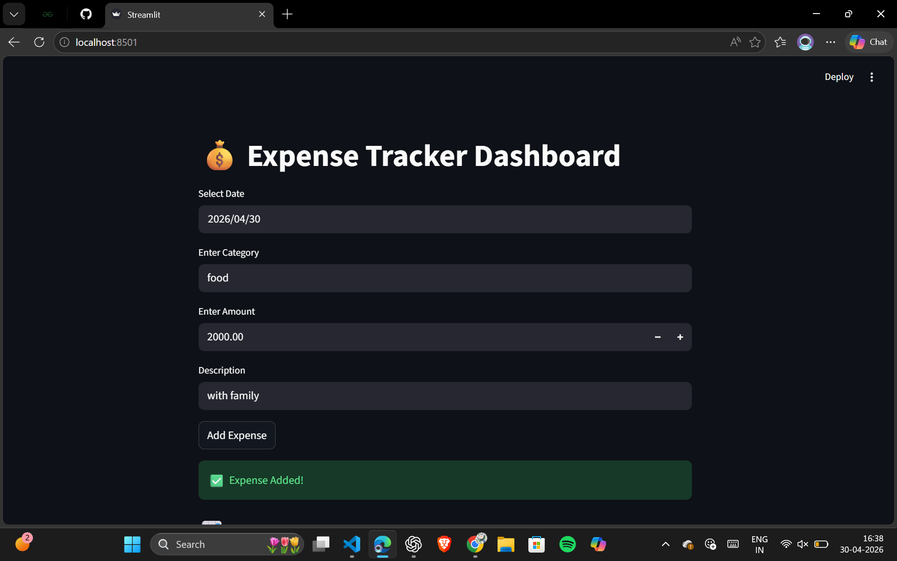

# 💰 Personal Expense Tracker (Major Project)

## 📌 Overview
A Python-based Expense Tracker with an interactive web dashboard built using Streamlit.  
This project allows users to track daily expenses, visualize spending patterns, and get basic predictions of future expenses.

---

## 🚀 Features
- ➕ Add expenses via UI  
- 📊 View data in tabular format  
- 📅 Monthly filtering system  
- 📈 Category-wise bar chart  
- 🥧 Pie chart for distribution  
- 🤖 Spending prediction using NumPy  
- ⚡ Real-time dashboard  

---

## 🛠️ Tech Stack
- Python  
- Pandas  
- NumPy  
- Streamlit  
- Matplotlib  

---

## ▶️ How to Run Locally

1. Install dependencies:

